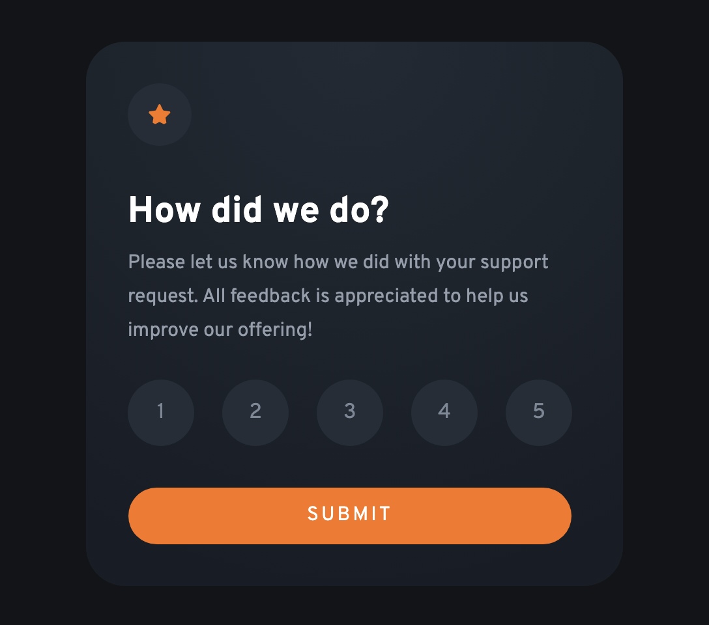
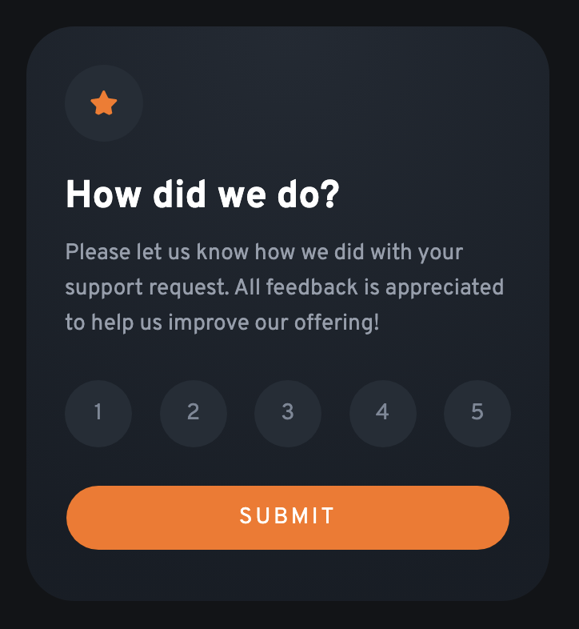

# Frontend Mentor - Interactive rating component solution

This is a solution to the [Interactive rating component challenge on Frontend Mentor](https://www.frontendmentor.io/challenges/interactive-rating-component-koxpeBUmI). Frontend Mentor challenges help you improve your coding skills by building realistic projects. 

## Table of contents

- [Overview](#overview)
  - [The challenge](#the-challenge)
  - [Screenshot](#screenshot)
  - [Links](#links)
- [My process](#my-process)
  - [Built with](#built-with)
  - [What I learned](#what-i-learned)
- [Author](#author)

## Overview

### The challenge

Users should be able to:

- View the optimal layout for the app depescreDnding on their device's screen size
- See hover states for all interactive elements on the page
- Select and submit a number rating
- See the "Thank you" card state after submitting a rating

### Screenshot

#### Desktop Design

#### Mobile Design

### Links

- Solution URL: [https://github.com/cuonglyy/interactive-rating-component](https://github.com/cuonglyy/interactive-rating-component)
- Live Site URL: [https://cuonglyy.github.io/interactive-rating-component/](https://cuonglyy.github.io/interactive-rating-component/)

## My process

### Built with

- Semantic HTML5 markup
- CSS custom properties
- Flexbox
- Mobile-first workflow
- JavaScript
- Local Storage

### What I learned

I was able to review my JavaScript by implementing some Array built-in methods and using local storage to store and obtain data. 

## Author

- Website - [Cuong Ly](https://www.lyqcuong.com/)
- Frontend Mentor - [@cuonglyy](https://www.frontendmentor.io/profile/cuonglyy)
